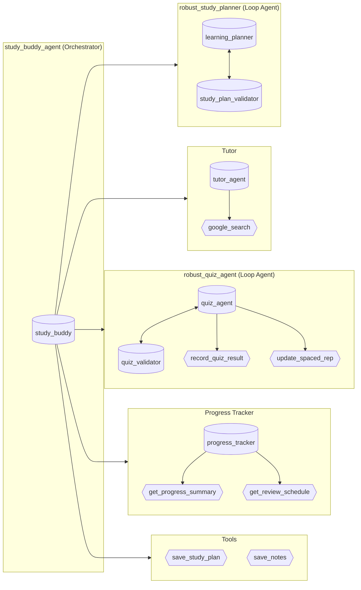

# StudyBuddy Architecture Diagram

## Mermaid Diagram (renders on GitHub)



## Text Diagram (for draw.io or similar)

```
                    ┌─────────────────────────────────────────────────────────┐
                    │           robust_study_planner (Loop Agent)             │
                    │  ┌─────────────────┐      ┌──────────────────────────┐  │
                    │  │ learning_planner │◄────►│ study_plan_validator     │  │
                    │  └─────────────────┘      └──────────────────────────┘  │
                    └─────────────────────────────────────────────────────────┘
                                              ▲
                                              │
                    ┌─────────────────────────────────────────────────────────┐
                    │                    tutor_agent                          │
                    │  ┌─────────────────┐      ┌──────────────────────────┐  │
                    │  │   tutor_agent   │─────►│     google_search        │  │
                    │  └─────────────────┘      └──────────────────────────┘  │
                    └─────────────────────────────────────────────────────────┘
                                              ▲
                                              │
┌──────────────────────┐                      │
│                      │──────────────────────┤
│  study_buddy_agent   │                      │
│    (Orchestrator)    │──────────────────────┤
│                      │                      │
└──────────────────────┘                      │
          │                                   ▼
          │           ┌─────────────────────────────────────────────────────────┐
          │           │             robust_quiz_agent (Loop Agent)              │
          │           │  ┌─────────────────┐      ┌──────────────────────────┐  │
          │           │  │   quiz_agent    │◄────►│    quiz_validator        │  │
          │           │  └────────┬────────┘      └──────────────────────────┘  │
          │           │           │                                             │
          │           │           ├──► record_quiz_result                       │
          │           │           └──► update_spaced_repetition                 │
          │           └─────────────────────────────────────────────────────────┘
          │
          │           ┌─────────────────────────────────────────────────────────┐
          │           │                  progress_tracker                       │
          │           │  ┌─────────────────┐                                    │
          └──────────►│  │progress_tracker │──► get_progress_summary            │
                      │  └─────────────────┘──► get_review_schedule             │
                      └─────────────────────────────────────────────────────────┘
          │
          │           ┌─────────────────────────────────────────────────────────┐
          └──────────►│                      Tools                              │
                      │     save_study_plan_to_file    save_notes_to_file       │
                      └─────────────────────────────────────────────────────────┘
```

## Simple Version (like the example image)

To recreate in draw.io or similar tool:

1. **Main Node (Green oval):** `study_buddy_agent` (Orchestrator)

2. **Loop Agent Box 1:** `robust_study_planner (Loop Agent)`
   - Contains: `learning_planner` ◄──► `study_plan_validator`

3. **Tutor Node:** `tutor_agent`
   - Connected to: `google_search` (tool)

4. **Loop Agent Box 2:** `robust_quiz_agent (Loop Agent)`  
   - Contains: `quiz_agent` ◄──► `quiz_validator`
   - Tools: `record_quiz_result`, `update_spaced_rep`

5. **Progress Node:** `progress_tracker`
   - Tools: `get_progress_summary`, `get_review_schedule`

6. **Tool Nodes:**
   - `save_study_plan_to_file`
   - `save_notes_to_file`

## Color Scheme Suggestion

- **Orchestrator:** Green (like the example)
- **Agents:** White/light gray ovals with robot icon
- **Tools:** White ovals with wrench icon
- **Loop Agent boxes:** Rounded rectangle borders
- **Background:** Dark gray (#2d2d2d)
